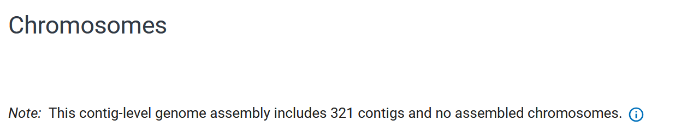
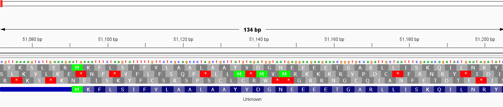
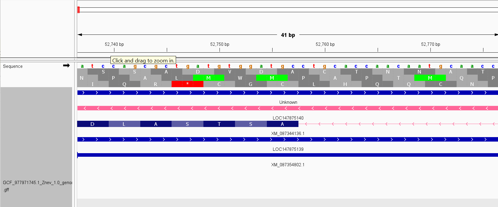

### Answers

Prerequisites

    Select a genome and an annotation file.
        The genome I chose is Zootermopsis nevadensis (termites)
    Load both into a genome visualization platform.
        I chose IGV

- **How tightly packed are the genes in this genome? Estimate the gene-to-gene distance via the browser.**
    - Using the IGV browser, I can estimate that the distance is approximately 108 using a few genes. However, when I write a script to confirm, I get an average gene-to-gene distance of average distance: 11,669 and a median distance of 1155. This is because the smallest distance is 0 (which means the genes are overlapping) and the largest distance is 2,177,515.

equations: $\sum \frac{start\:position\:of\:next\:gene - end\:position\:of\:previous\:gene - 1}{n\_positions} = average\:position$

- **Pick a coordinate on the chromosome and visually inspect the sequence regions around it.**
    - The contigs were not assembled to chromosome level. But on contig NW_028259133.1 there is gene LOC147875140 with GeneID 147875140 it spans positions 52541 from 62862. It is a peroxisomal multifunctional enzyme type 2-like. Directly preceeding the gene there is a A C rich area for approximately 16 bases. After the gene is enriched in G, A, T but not C.

[info](https://www.ncbi.nlm.nih.gov/datasets/genome/GCF_977971745.1/)

- Describe all six reading frames (codons) that the coordinate could be part of.
    - Since the start codon starts at AUG where U would correspond to the T. The gene is on the negative strand. On the forward strand, the first open reading frame has a lot of false starts, there is a 3 amino acid protein from 52,594 to 52,598 many other possible ORF throughout. There are also multiple potential proteins on ORF 2 and ORF 3 though most correspond with small amino acid chains. The protein is on the reverse strand starting at 52,744 and ending at 52,578 (on the forward strand). The first open reading frame carries the protein and similar to the forward strand, all three ORF have a lot of false starts for proteins. 

- Identify the type of feature displayed as a data track
Color features by their strand orientation.

The feature in image 1 on the data track is gene LOC147875139. It is on the forward track which is identifiable my the blue track. The feature in image 2 on the data track is gene LOC147875140 which is identifiably on the reverse track since the track is pink.

** forward gene on the data track **

** reverse gene on the data track **

