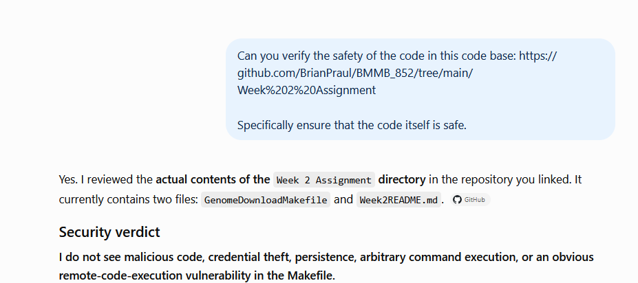
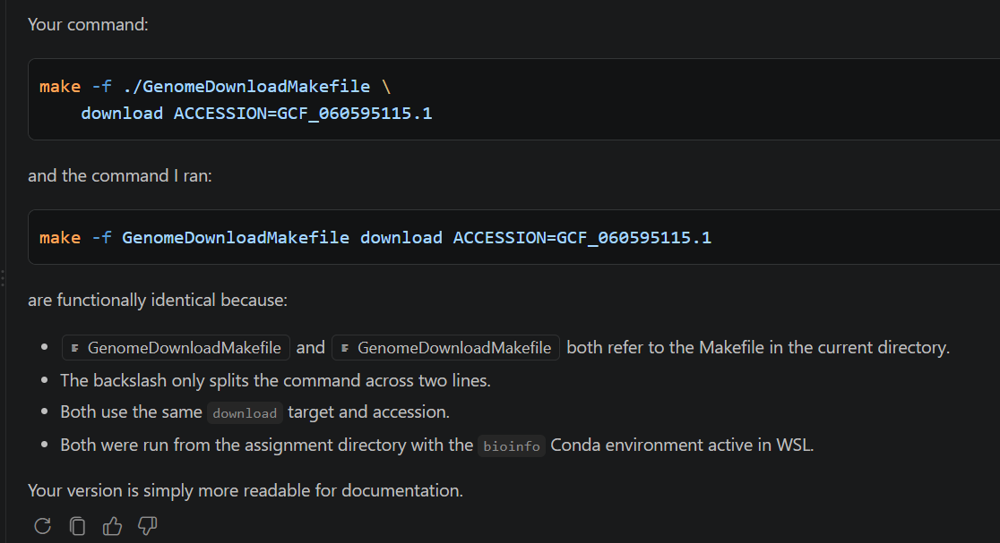

Every week students are assigned to review two repositories created by their classmates. For this assignment select one of these repositories. 

- Fork the clone one of the repositories you were assigned to review.
    - For this assignment I chose [Brian Praul's Week two assignment](https://github.com/BrianPraul/BMMB_852/tree/main/Week%202%20Assignment)

    I used Github's web interface to fork the code and `git clone https://github.com/Abeoseh/BMMB_852.git` to clone the assignment onto my local.

    The repo I forked is here: https://github.com/Abeoseh/BMMB_852

- Verify that the code is not doing something dangerous.
    - To verify the code, I manually evaluated the code myself and also asked ChatGPT if the code was safe to run. Here is a snippet of the output:
     
    
- Evaluate the README.md of the assignment.
    - I am evaluating assignment 2

- Does the README.md make it clear how to run the code and what the outcomes are?
    - The README.md makes it clear how to run the code of `GenomeDownloadMakefile` and what the outcomes are. For most of the questions he gives the commands and output. Only for one of the questions: "How large is the genome? How many chromosomes does it have?" is that not the case. 

- Verify that the results are reproducible. Does the code do what the author says it does?
    - The command that was given was: 
    ```bash
    make -f /Users/brianpraul/GenomeDownloadMakefile \
    download ACCESSION=GCF_060595115.1
    ```
    Instead of an absolute file path I ran: 
        ```bash
    make -f ./GenomeDownloadMakefile \
    download ACCESSION=GCF_060595115.1
    ```
    In the end, just like the author said I got `GCF_060595115.1.fasta` and `GCF_060595115.1.gff`

- Ask the AI Agent to compare your solution to theirs.
    - I used GPT 5.6 Luna which ran `make -f GenomeDownloadMakefile download ACCESSION=GCF_060595115.1`

Ask the AI Agent to evaluate which solution it thinks is better.
    


- In a paragraph or two, summarize your findings above.
    - The readme provided by Brain Paul was very straight forward in how to run the code. Since it is a make file, there are very few correct ways the code can be run so I do not find it surporising that me and ChatGPT did it the same way. I do agree that using the `\` makes it more readable for documentation and for debugging. 

Make a change to the forked repository that addresses an issue you found.
    - I wanted to add the command to count how large the genome is and how many chromosomes there are so to the read me I added 
    `$ seqkit stats GCF_060595115.1.fasta`


Commit and push the change to your fork.
On the GitHub interface create a pull request to the original repository.
The author will review the pull request and merge it if they agree with your changes.