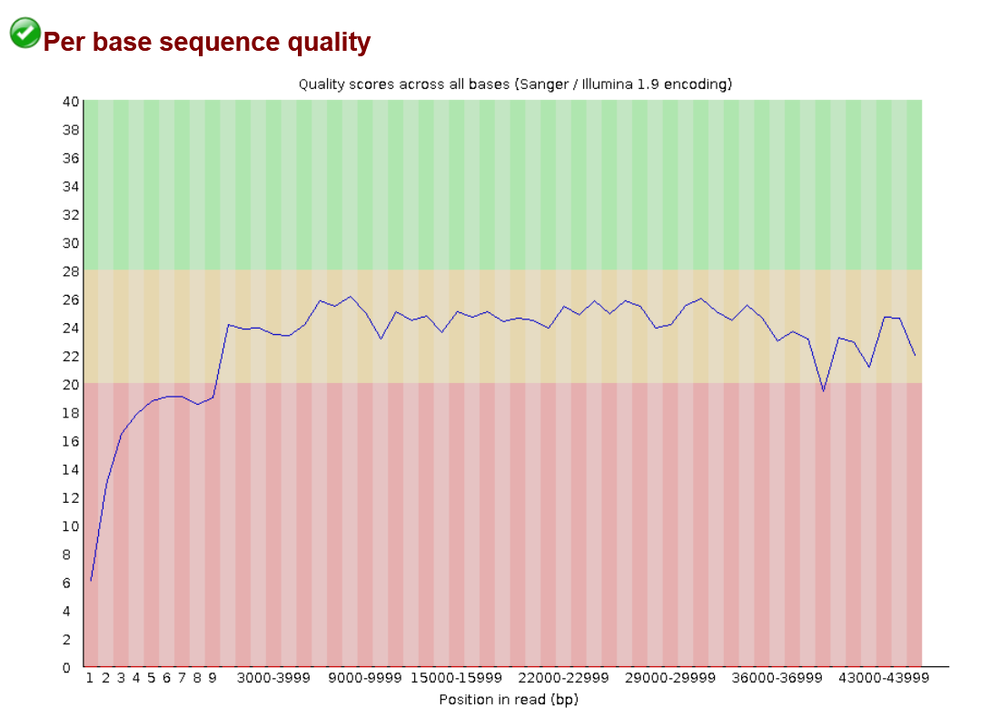
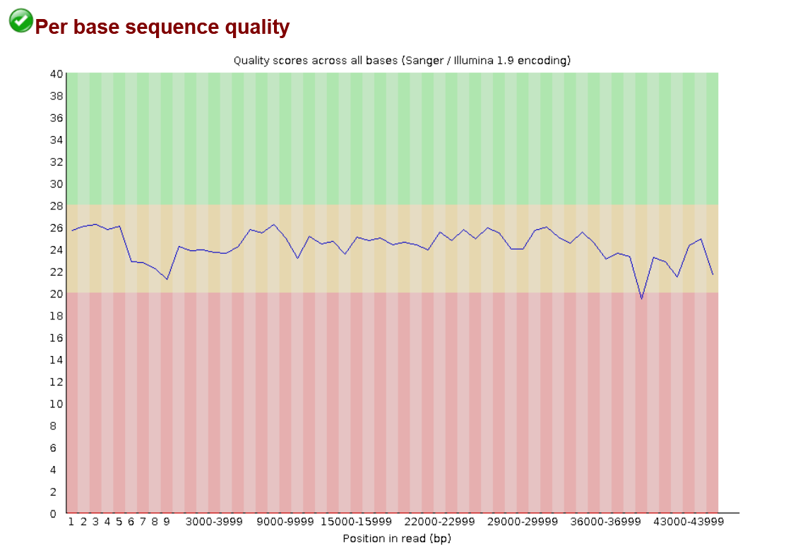

# Assignment 4

## Assess the experimental evidence for the genome

1. How "popular" is this genome? How many datasets are available?
> I searched https://www.ncbi.nlm.nih.gov/sra for `(Zootermopsis nevadensis[Organism]) OR termites[Organism]` and got 4545 total sequences with 469 whole genome sequences.

-----------------
2. What is the breakdown by sequencing strategy and platform (or some other attribute)?
>     Platform
>        BGISEQ(3)
>        Capillary(16)
>        Illumina(4,276)
>        LS454(19)
>        Oxford Nanopore(90)
>        PacBio SMRT(31)

>     Strategy
>        EpiGenomics(47)
>        Exome(490) 
>        Genome(490) 
>        RNASeq(1) 
>        other(3,517)

------------
3. What do you find interesting or surprising?
> It is interesting that there are so few RNAseq datasets. I thought that since termites are such a common pest people would be more interested in studying the genetic expression to better target them for removal.

-----
## Download FASTQ files for an experiment
1. The Makefile should download the first N reads from an SRR accession.
2. Place the files in directories named after the data type.
3. Run a QC visualization on the downloaded reads to generate a report.
4. Apply a QC method to the reads to see whether it makes a visual difference.
5. Run a QC visualization on the trimmed reads to generate a report.

Running the make file **without** command line arguments: 
`make` 
which automatically uses `SRR40309130` with `10` reads

Running the make file **with** command line arguments
`make SRR SRR_ID=SRR_ID N=NUM_READS` 
for example: 
`make SRR SRR_ID=SRR40309131 N=10`

As my quality control software, I used fastqc to read the base scores then used fastp to trim the low quality beginning and ends as well as the adapters. When I run the make files on SRR40309131 with 10 reads I have very low quality beginnings which is then trimmed after fastp.

**Before fastp**

**After fastp**
