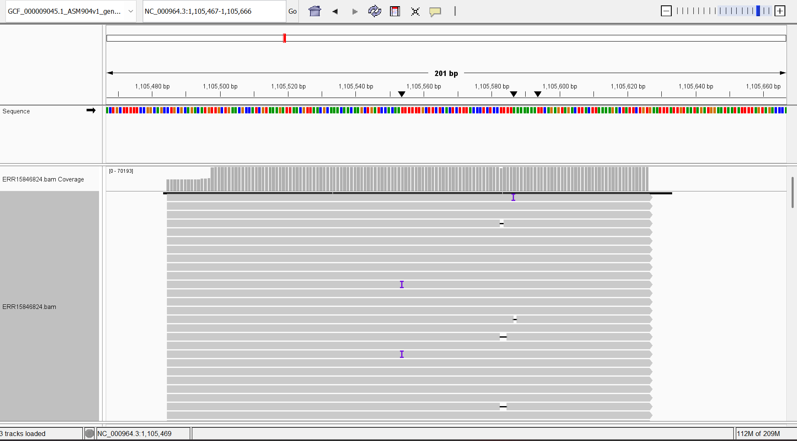
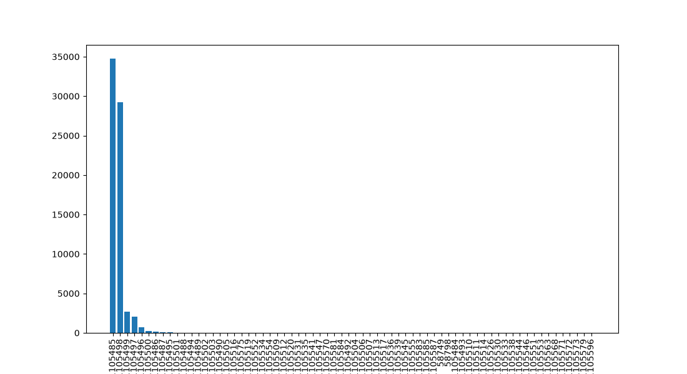

# Assignment 5

## Explain how you arrived at N

The SRA experiment I am using is **ERR15846824** which was sequenced using Illumina HiSeq 2500 which tends to generate reads of length 300 bases (or 600 bases for paired end reads). The genome size for "Bacillus subtilis subsp. subtilis str. 168" is 4.2Mb. The equation for coverage is:

$coverage = \frac{read\\_length * num\\_reads}{genome\\_size}$

so to get the total number of reads for 10x coverage at a read length of 600 I would use:

$$
num\_reads = \frac{genome\\_size * coverage}{read\\_length}
= \frac{4,215,606*10x}{600} = 70,260.1
$$

For paired ends I will do do $70,260.1/2=35130.05$ or $35130$ since I am using paired end reads.

Since I am doing paired end reads, each spot corresponds to 2 reads so I will use `fastq-dump -X 35130` or in my make file `-N 35130`

## What percent of the reads align?

running `samtools flagstat ERR15846824/bam/ERR15846824.bam` gave me 
```
70261 + 0 in total (QC-passed reads + QC-failed reads)
70260 + 0 primary
0 + 0 secondary
1 + 0 supplementary
0 + 0 duplicates
0 + 0 primary duplicates
70214 + 0 mapped (99.93% : N/A)
70213 + 0 primary mapped (99.93% : N/A)
70260 + 0 paired in sequencing
35130 + 0 read1
35130 + 0 read2
69284 + 0 properly paired (98.61% : N/A)
70178 + 0 with itself and mate mapped
35 + 0 singletons (0.05% : N/A)
0 + 0 with mate mapped to a different chr
0 + 0 with mate mapped to a different chr (mapQ>=5)
```
This tells me 99.93% mapped with 98.61% properly paired.


## What do the alignments look like? Do the reads show errors or variations?


The alignments are not uniform and there are very few errors.

## Is the coverage uniform?
`coverage.py` gives coverage stats


There are 69 positions with a max coverage of 34759 and a min coverage of 1. Most places have a coverage of 1 read while 1105485 has the most read coverages at 34759.